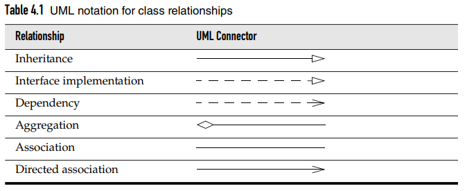
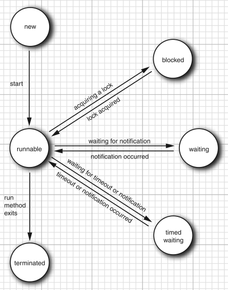
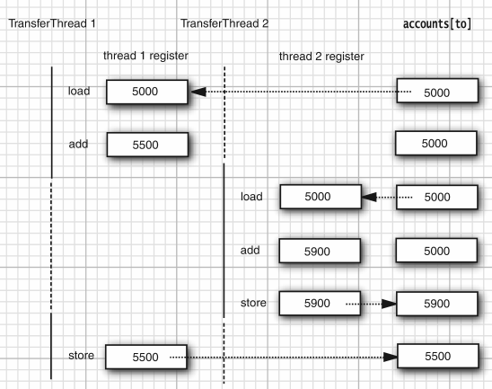

### String

|          | String   | StringBuilder | StringBuffer |
| -------- | -------- | ------------- | ------------ |
| 可变     | N        | Y             | Y            |
| 线程安全 | Y        | N             | Y(同步锁)    |
| 场景     | 少量数据 | 单线程        | 多线程       |


```java
public static void test01() {
 String s1 = "ab";
 String s2 = "cd";
 String s3 = "ab";

 System.out.println(s1.hashCode()); //3105
 System.out.println(s2.hashCode()); //3169
 System.out.println(s3.hashCode()); //3105

 /**
  * Conclusion:
  * 1. String value not equal -> hashcode not equal.
  * 2. String value equal -> hashcode equal, no need to create new String.
  */
}
```


```java
public static void test02() {
 //A
 StringBuilder sb1 = new StringBuilder();
 long start1 = System.currentTimeMillis();
 for (int i = 0; i < 10000000; i++) {
  sb1.append(i);
 }
 long end1 = System.currentTimeMillis();
 System.err.println(end1 - start1);

 //B
 StringBuffer sb2 = new StringBuffer();
 long start2 = System.currentTimeMillis();
 for (int i = 0; i < 10000000; i++) {
  sb2.append(i);
 }
 long end2 = System.currentTimeMillis();
 System.err.println(end2 - start2);

 /**
  * Conclusion:
  * StringBuilder faster than StringBuffer, cause the lock.
  */
}
```


### Object-Oriented

**Encapsulation**

- The key to making encapsulation work is to have methods never directly access instance fields in a class other than their own. Programs should interact with object data only through the object’s methods. 

- Encapsulation is the way to give an object its “black box” behavior, which is the key to reuse and reliability.

```java
public class Encapsulate {
 private String geekName;
 private int geekAge;

 public int getAge() {
  return geekAge;
 }
 public String getName() {
  return geekName;
 }
 public void setAge(int newAge) {
  geekAge = newAge;
 }
 public void setName(String newName) {
  geekName = newName;
 }
}
```

- These are obvious examples of accessor methods. As they simply return the values of instance fields, they are sometimes called field accessors.

- Advantages of Encapsulation:
  - **Data Hiding:** The user will have no idea about the  inner implementation of the class. It will not be visible to the user  that how the class is storing values in the variables. He only knows  that we are passing the values to a setter method and variables are  getting initialized with that value.
  - **Increased Flexibility:** We can make the variables of  the class as read-only or write-only depending on our requirement. If  we wish to make the variables as read-only then we have to omit the  setter methods like setName(), setAge() etc. from the above program or  if we wish to make the variables as write-only then we have to omit the  get methods like getName(), getAge() etc. from the above program
  - **Reusability:** Encapsulation also improves the re-usability and easy to change with new requirements.
  - **Testing code is easy:** Encapsulated code is easy to test for unit testing.


**Inheritance**

- When you extend an existing class, the new class has all the properties and methods of the class that you extend. You then supply new methods and data fields that apply to your new class only. The concept of extending a class to obtain another class is called inheritance.

- Important terminology: 
  - **Super Class:** The class whose features are inherited is known as super class(or a base class or a parent class).
  - **Sub Class:** The class that inherits the other class  is known as sub class(or a derived class, extended class, or child  class). The subclass can add its own fields and methods in addition to  the superclass fields and methods.
  - **Reusability:**  Inheritance supports the concept of  “reusability”, i.e. when we want to create a new class and there is  already a class that includes some of the code that we want, we can  derive our new class from the existing class. By doing this, we are  reusing the fields and methods of the existing class.

- Example

  ```java
  // base class 
  class Bicycle {
   public int gear;
   public int speed;
  
   public Bicycle(int gear, int speed) {
    this.gear = gear;
    this.speed = speed;
   }
  
   public void applyBrake(int decrement) {
    speed -= decrement;
   }
  
   public void speedUp(int increment) {
    speed += increment;
   }
  
   public String toString() {
    return ("No of gears are " + gear +
     "\n" +
     "speed of bicycle is " + speed);
   }
  }
  
  // derived class 
  class MountainBike extends Bicycle {
   public int seatHeight;
  
   public MountainBike(int gear, int speed, int startHeight) {
    super(gear, speed);
    seatHeight = startHeight;
   }
  
   public void setHeight(int newValue) {
    seatHeight = newValue;
   }
  
   @Override
   public String toString() {
    return (super.toString() +
     "\nseat height is " + seatHeight);
   }
  }
  
  public class Test {
   public static void main(String args[]) {
    MountainBike mb = new MountainBike(3, 100, 25);
    System.out.println(mb.toString());
   }
  }
  ```

- Types of Inheritance in Java

  - Single Inheritance

    

    ```java
    class one {
     public void print_geek() {
      System.out.println("Geeks");
     }
    }
    
    class two extends one {
     public void print_for() {
      System.out.println("for");
     }
    }
    
    public class Main {
     public static void main(String[] args) {
      two g = new two();
      g.print_geek();
      g.print_for();
      g.print_geek();
     }
    }
    ```

  - Multilevel Inheritance

    

    ```java
    class one {
     public void print_geek() {
      System.out.println("Geeks1");
     }
    }
    
    class two extends one {
     public void print_for() {
      System.out.println("for");
     }
    }
    
    class three extends two {
     public void print_geek() {
      System.out.println("Geeks2");
     }
    }
    
    public class Main {
     public static void main(String[] args) {
      three g = new three();
      g.print_geek();
      g.print_for();
      g.print_geek();
     }
    }
    ```

  - Hierarchical Inheritance

    

    ```java
    class one {
     public void print_geek() {
      System.out.println("Geeks");
     }
    }
    
    class two extends one {
     public void print_for() {
      System.out.println("for");
     }
    }
    
    class three extends one {
     /*............*/
    }
    
    public class Main {
     public static void main(String[] args) {
      three g = new three();
      g.print_geek();
      two t = new two();
      t.print_for();
      g.print_geek();
     }
    }
    ```

  - Multiple Inheritance (Through Interfaces)

    

    ```java
    interface one {
     public void print_geek();
    }
    
    interface two {
     public void print_for();
    }
    
    interface three extends one, two {
     public void print_geek();
    }
    class child implements three {
     @Override
     public void print_geek() {
      System.out.println("Geeks");
     }
    
     public void print_for() {
      System.out.println("for");
     }
    }
    
    public class Main {
     public static void main(String[] args) {
      child c = new child();
      c.print_geek();
      c.print_for();
      c.print_geek();
     }
    }
    ```

  - Hybrid Inheritance(Through Interfaces)

    


**Relationships between Classes**

- Dependence (“uses–a”)

  - For example, the Order class uses the Account class because Order objects need to access Account objects to check for credit status. But the Item class does not depend on the Account class, because Item objects never need to worry about customer accounts. Thus, a class depends on another class if its methods use or manipulate objects of that class. 

- Aggregation (“has–a”)

  - The aggregation, or “has–a” relationship, is easy to understand because it is concrete; for example, an Order object contains Item objects. Containment means that objects of class A contain objects of class B.

- Inheritance (“is–a”) 

  - The inheritance, or “is–a” relationship, expresses a relationship between a more special and a more general class. For example, a RushOrder class inherits from an Order class. The specialized RushOrder class has special methods for priority handling and a different method for computing shipping charges, but its other methods, such as adding items and billing, are inherited from the Order class. In general, if class A extends class B, class A inherits methods from class B but has more capabilities.





**Polymorphism**

- The “is–a” rule states that every object of the subclass is an object of the superclass. For example, every manager is an employee. Thus, it makes sense for the Manager class to be a subclass of the Employee class. Naturally, the opposite is not true—not every employee is a manager. 

- In the Java programming language, object variables are polymorphic. A variable of type Employee can refer to an object of type Employee or to an object of any subclass of the Employee class (such as Manager, Executive, Secretary, and so on). 

  ```java
  Employee e;
  e = new Employee(. . .); // Employee object expected
  e = new Manager(. . .); // OK, Manager can be used as well
  ```

- In this case, the variables staff[0] and boss refer to the same object. However, staff[0] is considered to be only an Employee object by the compiler 

  ```java
  Manager boss = new Manager(. . .);
  Employee[] staff = new Employee[3];
  staff[0] = boss;
  
  boss.setBonus(5000); // OK
  //The declared type of staff[0] is Employee, and the setBonus method is not a method of the Employee class.
  staff[0].setBonus(5000); // Error
  ```

- However, you cannot assign a superclass reference to a subclass variable. The reason is clear: Not all employees are managers. 

  ```java
  Manager m = staff[i]; // Error
  ```


### Constructor

- To work with objects, you first construct them and specify their initial state. Then you apply methods to the objects.

- In the Java programming language, you use constructors to construct new instances.

- A constructor is a special method whose purpose is to construct and initialize objects.

- A constructor has the same name as the class.
- A class can have more than one constructor.
- A constructor can take zero, one, or more parameters.
- A constructor has no return value.
- A constructor is always called with the new operator. 


### Final

- You can define an instance field as final. Such a field must be initialized when the object is constructed. That is, you must guarantee that the field value has been set after the end of every constructor. Afterwards, the field may not be modified again.

  ```java
  class Employee {
   private final String name;
  }
  ```

- Occasionally, you want to prevent someone from forming a subclass from one of your classes. Classes that cannot be extended are called fnal classes, and you use the final modifer in the defnition of the class to indicate this. 

  ```java
  public final class Executive extends Manager{
  }
  ```

- You can also make a specifc method in a class final. If you do this, then no subclass can override that method. (All methods in a final class are automatically final.) 

  ```java
  public class Employee {
   public final String getName() {
    return name;
   }
  }
  ```

- Recall that fields can also be declared as final. A final field cannot be changed after the object has been constructed. However, if a class is declared final, only the methods, not the fields, are automatically final. 

- Fortunately, the just-in-time compiler in the virtual machine can do a better job than a traditional compiler. It knows exactly which classes extend a given class, and it can check whether any class actually overrides a given method. If a method is short, frequently called, and not actually overridden, the just-in-time compiler can inline the method. 


### Static

**Static Fields**

```java
class Employee {
 private static int nextId = 1;
 private int id;
 ...
}
```

- Every employee object now has its own id field, but there is only one nextId field that is shared among all instances of the class. Let’s put it another way. If there are 1,000 objects of the Employee class, then there are 1,000 instance fields id, one for each object. But there is a single static field nextId. Even if there are no employee objects, the static field nextId is present. It belongs to the class, not to any individual object.


**Static Constants**

```java
public class Math {
 public static final double PI = 3.14159265358979323846;
}
```

- If the keyword static had been omitted, then PI would have been an instance field of the Math class. That is, you would need an object of this class to access PI, and every Math object would have its own copy of PI.


**Static Methods**

- You can think of static methods as methods that don’t have a this parameter.
- A static method of the Employee class cannot access the id instance field because it does not operate on an object. However, a static method can access a static field.

```java
public static int getNextId() {
 return nextId; // returns static field
}
```

- Use static methods in two situations:
  - When a method doesn’t need to access the object state because all needed parameters are supplied as explicit parameters (example: Math.pow).
  - When a method only needs to access static fields of the class (example: Employee.getNextId).


### Object Construction

**Overloading**

Some classes have more than one constructor. For example, you can construct an empty StringBuilder object as
`StringBuilder messages = new StringBuilder();`
Alternatively, you can specify an initial string:
`StringBuilder todoList = new StringBuilder("To do:\n"); `


**Default Field Initialization**

If you don’t set a field explicitly in a constructor, it is automatically set to a default value: numbers to 0, boolean values to false, and object references to null.


### Packages

- Java allows you to group classes in a collection called a package. Packages are convenient for organizing your work and for separating your work from code libraries provided by others. 
- The main reason for using packages is to guarantee the uniqueness of class names. 

- As long as both of them place their class into different packages, there is no conflict. In fact, to absolutely guarantee a unique package name, use an Internet domain name (which is known to be unique) written in reverse. 


**Class Importation**

- A class can use all classes from its own package and all public classes from other packages. 

- Locating classes in packages is an activity of the compiler. The bytecodes in class files always use full package names to refer to other classes. 


**Static Imports**

- A form of the import statement permits the importing of static methods and fields, not just classes. 

  ```java
  import static java.lang.System.*;
  
  out.println("Goodbye, World!"); // i.e. System.out
  exit(0); // i.e. System.exit
  ```


**Package Scope**

- If you don’t specify either public or private, the feature (that is, the class, method, or variable) can be accessed by all methods in the same package. 


### Class

**Class Design Hints**

- Always keep data private
- Always initialize data
- Don’t use too many basic types in a class
- Not all fields need individual field accessors and mutators
- Make the names of your classes and methods reflect their responsibilities
- Prefer immutable classes


**Overriding Methods**

- Some of the superclass methods are not appropriate for the Manager subclass. In particular, the getSalary method should return the sum of the base salary and the bonus. You need to supply a new method to override the superclass method: 

    ```java
    public class Manager extends Employee {
     public double getSalary() {
      double baseSalary = super.getSalary();
      return baseSalary + bonus;
     }
    }
    ```

- As you saw, a subclass can add fields, and it can add methods or override the methods of the superclass. However, inheritance can never take away any fields or methods. 


**Subclass Constructors**

- Here, the keyword super has a different meaning. The instruction is shorthand for “call the constructor of the Employee superclass with n, s, year, month, and day as parameters.” 

    ```java
    public class Manager extends Employee {
     public Manager(String name, double salary, int year, int month, int day) {
      super(name, salary, year, month, day);
      bonus = 0;
     }
    }
    ```

- Since the Manager constructor cannot access the private fields of the Employee class, it must initialize them through a constructor. The constructor is invoked with the special super syntax. The call using super must be the first statement in the constructor for the subclass. 

- If the subclass constructor does not call a superclass constructor explicitly, the no-argument constructor of the superclass is invoked. 
- If the superclass does not have a no-argument constructor and the subclass constructor does not call another superclass constructor explicitly, the Java compiler reports an error. 
- Recall that the this keyword has two meanings: to denote a reference to the implicit parameter and to call another constructor of the same class. Likewise, the super keyword has two meanings: to invoke a superclass method and to invoke a superclass constructor.  


**Abstract Classes**

- As you move up the inheritance hierarchy, classes become more general and probably more abstract. At some point, the ancestor class becomes so general that you think of it more as a basis for other classes than as a class with specifc instances you want to use. Consider, for example, an extension of our Employee class hierarchy. An employee is a person, and so is a student. Let us extend our class hierarchy to include classes Person and Student. 
- Why bother with so high a level of abstraction? There are some attributes that make sense for every person, such as name. Both students and employees have names, and introducing a common superclass lets us factor out the getName method to a higher level in the inheritance hierarchy 


- If you use the abstract keyword, you do not need to implement the method at all. 

  ```java
  public abstract class Person{
      // no implementation required
      public abstract String getDescription();
  }
  ```

- In addition to abstract methods, abstract classes can have fields and concrete methods.  

  ```java
  public abstract class Person{
      private String name;
      public Person(String name){
          this.name = name;
      }
      public abstract String getDescription();
      public String getName(){
          return name;
      }
  }
  ```

- Abstract methods act as placeholders for methods that are implemented in the subclasses. When you extend an abstract class, you have two choices. You can leave some or all of the abstract methods undefined; then you must tag the subclass as abstract as well. Or you can defne all methods, and the subclass is no longer abstract. 

- Abstract classes cannot be instantiated. That is, if a class is declared as abstract, no objects of that class can be created. 

- Note that you can still create object variables of an abstract class, but such a variable must refer to an object of a nonabstract subclass. For example: 

  ```java
  Person p = new Student("Vince Vu", "Economics");
  ```

- Keep in mind that the variable p never refers to a Person object because it is impossible to construct an object of the abstract Person class. 

  ```java
  Person p = new Student(. . .);
  p.getDescription()
  ```


**Protected Acess**

- As you know, fields in a class are best tagged as private, and methods are usually tagged as public. Any features declared private won’t be visible to other classes. 
- Protected methods make more sense. A class may declare a method as protected if it is tricky to use. This indicates that the subclasses (which, presumably, know their ancestor well) can be trusted to use the method correctly, but other classes cannot. 
- The four access modifers in Java that control visibility: 
  - Visible to the class only (private).
  - Visible to the world (public).
  - Visible to the package and all subclasses (protected).
  - Visible to the package—the (unfortunate) default. No modifers are needed. 


### Method

1. The compiler looks at the declared type of the object and the method name. Note that there may be multiple methods, all with the same name, f, but with different parameter types. For example, there may be a method f(int) and a method f(String). The compiler enumerates all methods called f in the class C and all accessible methods called f in the superclasses of C. (Private methods of the superclass are not accessible.) Now the compiler knows all possible candidates for the method to be called.
2. Next, the compiler determines the types of the arguments that are supplied in the method call. If among all the methods called f there is a unique method whose parameter types are a best match for the supplied arguments, that method is chosen to be called. This process is called overloading resolution. For example, in a call x.f("Hello"), the compiler picks f(String) and not f(int). The situation can get complex because of type conversions (int to double, Manager to Employee, and so on). If the compiler cannot find any method with matching parameter types or if multiple methods all match after applying conversions, the compiler reports an error. Now the compiler knows the name and parameter types of the method that needs to be called. 
3. If the method is private, static, final, or a constructor, then the compiler knows exactly which method to call. (The final modifer is explained in the next section.) This is called static binding. Otherwise, the method to be called depends on the actual type of the implicit parameter, and dynamic binding must be used at runtime. In our example, the compiler would generate an instruction to call f(String) with dynamic binding. 
4. When the program runs and uses dynamic binding to call a method, the virtual machine must call the version of the method that is appropriate for the actual type of the object to which x refers. Let’s say the actual type is D, a subclass of C. If the class D defnes a method f(String), that method is called. If not, D’s superclass is searched for a method f(String), and so on.


- It would be time consuming to carry out this search every time a method is called. Therefore, the virtual machine precomputes for each class a method table that lists all method signatures and the actual methods to be called. When a method is actually called, the virtual machine simply makes a table lookup. In our example, the virtual machine consults the method table for the class D and looks up the method to call for f(String). That method may be D.f(String) or X.f(String), where X is some superclass of D. There is one twist to this scenario. If the call is super.f(param), then the compiler consults the method table of the superclass of the implicit parameter. 


- The getSalary method is not private, static, or final, so it is dynamically bound. The virtual machine produces method tables for the Employee and Manager classes. The Employeetable shows that all methods are defined in the Employee class itself:

    ```
    Employee:
    getName() -> Employee.getName()
    getSalary() -> Employee.getSalary()
    getHireDay() -> Employee.getHireDay()
    raiseSalary(double) -> Employee.raiseSalary(double) 
    ```

- The Manager method table is slightly different. Three methods are inherited, one method is redefined, and one method is added. 

    ```
    Manager:
    getName() -> Employee.getName()
    getSalary() -> Manager.getSalary()
    getHireDay() -> Employee.getHireDay()
    raiseSalary(double) -> Employee.raiseSalary(double)
    setBonus(double) -> Manager.setBonus(double)
    ```

- Dynamic binding has a very important property: It makes programs extensible without the need for modifying existing code. Suppose a new class Executive is added and there is the possibility that the variable e refers to an object of that class. The code containing the call e.getSalary() need not be recompiled. The Executive.getSalary() method is called automatically if e happens to refer to an object of type Executive. 

- When you override a method, the subclass method must be at least as visible as the superclass method. In particular, if the superclass method is public, the subclass method must also be declared public. It is a common error to accidentally omit the public specifer for the subclass method. The compiler then complains that you try to supply a more restrictive access privilege. 


### Casting

- The process of forcing a conversion from one type to another is called casting. 

    ```java
    double x = 3.405;
    int nx = (int) x;
    ```

- The compiler checks that you do not promise too much when you store a value in a variable. If you assign a subclass reference to a superclass variable, you are promising less, and the compiler will simply let you do it. If you assign a superclass reference to a subclass variable, you are promising more. Then you must use a cast so that your promise can be checked at runtime 

    ```java
    Manager boss = (Manager) staff[0];
    ```

- Thus, it is good programming practice to find out whether a cast will succeed before attempting it. 

    ```java
    if (staff[1] instanceof Manager){
        boss = (Manager) staff[1];
    }
    ```

- You can cast only within an inheritance hierarchy.
- Use instanceof to check before casting from a superclass to a subclass. 
- The only reason to make the cast is to use a method that is unique to managers, such as setBonus. 


### Object Method

- The Object class is the ultimate ancestor—every class in Java extends Object. 
- In Java, only the values of primitive types (numbers, characters, and boolean values) are not objects. 


**The equals Method**

- The equals method in the Object class tests whether one object is considered equal to another. The equals method, as implemented in the Object class, determines whether two object references are identical. This is a pretty reasonable default—if two objects are identical, they should certainly be equal. 

    ```java
    public class Employee{
        public boolean equals(Object otherObject){
            // a quick test to see if the objects are identical
            if (this == otherObject) return true;
            // must return false if the explicit parameter is null
            if (otherObject == null) return false;
            // if the classes don't match, they can't be equal
            if (getClass() != otherObject.getClass())
                return false;
            // now we know otherObject is a non-null Employee
            Employee other = (Employee) otherObject;
            // test whether the fields have identical values
            return Objects.equals(name, other.name)
                && salary == other.salary
                && Object.equals(hireDay, other.hireDay);
        }
    }
    ```


**Equality Testing and Inheritance**

- The Java Language Specifcation requires that the equals method has the following properties: 
  - It is reflexive: For any non-null reference x, x.equals(x) should return true.
  - It is symmetric: For any references x and y, x.equals(y) should return true if and only if y.equals(x) returns true.
  - It is transitive: For any references x, y, and z, if x.equals(y) returns true and y.equals(z) returns true, then x.equals(z) should return true.
  - It is consistent: If the objects to which x and y refer haven’t changed, then repeated calls to x.equals(y) return the same value.
  - For any non-null reference x, x.equals(null) should return false. 

- Here is a recipe for writing the perfect equals method:
  - Name the explicit parameter otherObject—later, you will need to cast it to another variable that you should call other.

  - Test whether this happens to be identical to otherObject: 

    `if (this == otherObject) return true;`

    This statement is just an optimization. In practice, this is a common case. It is much cheaper to check for identity than to compare the fields.

  - Test whether otherObject is null and return false if it is. This test is required. 

    `if (otherObject == null) return false;`

  - Compare the classes of this and otherObject. If the semantics of equals can change in subclasses, use the getClass test: 

    `if (getClass() != otherObject.getClass()) return false;`

    If the same semantics holds for all subclasses, you can use an instanceof test: 

    `if (!(otherObject instanceof ClassName)) return false;`

  - Cast otherObject to a variable of your class type: 

    `ClassName other = (ClassName) otherObject`

  - Now compare the fields, as required by your notion of equality. Use == for primitive type fields, Objects.equals for object fields. Return true if all fields match, false otherwise.

    ```java
    return field1 == other.field1
    && Objects.equals(field2, other.field2)
        && . . .;
    ```

    If you redefne equals in a subclass, include a call to super.equals(other). 


**The hashCode Method**

- A hash code is an integer that is derived from an object. 

- The hashCode method is defined in the Object class. Therefore, every object has a default hash code. That hash code is derived from the object’s memory address.

- The strings s and t have the same hash code because, for strings, the hash codes are derived from their contents. The string builders sb and tb have different hash codes because no hashCode method has been defined for the StringBuilder class and the default hashCode method in the Object class derives the hash code from the object’s memory address. 

  ```java
  String s = "Ok";//2556
  StringBuilder sb = new StringBuilder(s);//366712642
  String t = new String("Ok");//2556
  StringBuilder tb = new StringBuilder(t);//1829164700
  ```


**The toString Method**

- Returns a string representing the value of this object.  

- Whenever an object is concatenated with a string by the “+” operator, the Java compiler automatically invokes the toString method to obtain a string representation of the object. 

  ```java
  Point p = new Point(10, 20);
  String message = "The current position is " + p;
  // automatically invokes p.toString()
  ```


### Array Lists

- The ArrayList class is similar to an array, but it automatically adjusts its capacity as you add and remove elements, without any additional code. 

- ArrayList is a generic class with a type parameter. To specify the type of the element objects that the array list holds, you append a class name enclosed in angle brackets, such as `ArrayList<Employee>`

- Here we declare and construct an array list that holds Employee objects: 

  ```java
  ArrayList<Employee> staff = new ArrayList<Employee>();
  //Java7 - omit the type parameter on the right-hand side
  ArrayList<Employee> staff = new ArrayList<>();
  ```

- If you call add and the internal array is full, the array list automatically creates a bigger array and copies all the objects from the smaller to the bigger array. 

- If you already know, or have a good guess, how many elements you want to store, call the ensureCapacity method before flling the array list:
  `staff.ensureCapacity(100); `

- You can also pass an initial capacity to the ArrayList constructor: 

  `ArrayList<Employee> staff = new ArrayList<>(100); `


### Wrappers & Autoboxing

- Wrappers: A class Integer corresponds to the primitive type int, names: Integer, Long, Float, Double, Short, Byte, Character, and Boolean. 
- The wrapper classes are immutable—you cannot change a wrapped value after the wrapper has been constructed. They are also final, so you cannot subclass them. 
- autoboxing

    ```java
    ArrayList<Integer> list = new ArrayList<>();
    list.add(3);
    //automatically translated to
    list.add(Integer.valueOf(3));
    ```

- unboxing

  ```java
  int n = list.get(i);
  // the compiler translates into
  int n = list.get(i).intValue();
  ```

- Boxing and unboxing is a courtesy of the compiler, not the virtual machine. The compiler inserts the necessary calls when it generates the bytecodes of a class. The virtual machine simply executes those bytecodes. 


### Reflection

- The reflection library gives you a very rich and elaborate toolset to write programs that manipulate Java code dynamically 

- A program that can analyze the capabilities of classes is called reflective. The reflection mechanism is extremely powerful. As the next sections show, you can use it to
  - Analyze the capabilities of classes at runtime;
  - Inspect objects at runtime—for example, to write a single toString method that works for all classes;
  - Implement generic array manipulation code
  - Take advantage of Method objects


**A Primer on Catching Exceptions**

- There are two kinds of exceptions: unchecked exceptions and checked exceptions. With checked exceptions, the compiler checks that you provide a handler. However, many common exceptions, such as accessing a null reference, are unchecked. The compiler does not check whether you provided a handler for these errors—after all, you should spend your mental energy on avoiding these mistakes rather than coding handlers for them. 

- But not all errors are avoidable. If an exception can occur despite your best efforts, then the compiler insists that you provide a handler. The Class.forName method is an example of a method that throws a checked exception. 
- Place one or more statements that might throw checked exceptions inside a try block. Then provide the handler code in the catch clause. 

- If the class name doesn’t exist, the remainder of the code in the try block is skipped and the program enters the catch clause. (Here, we print a stack trace by using the printStackTrace method of the Throwable class. Throwable is the superclass of the Exception class.) If none of the methods in the try block throws an exception, the handler code in the catch clause is skipped 


### Interfaces

- All methods of an interface are automatically public. For that reason, it is not necessary to supply the keyword public when declaring a method in an interface. 

- The reason for interfaces is that the Java programming language is strongly typed. When making a method call, the compiler needs to be able to check that the method actually exists. 


**Properties**

- Interfaces are not classes. In particular, you can never use the new operator to instantiate an interface

  `x = new Comparable(. . .); // ERROR `

- An interface variable must refer to an object of a class that implements the interface 

- Next, just as you use instanceof to check whether an object is of a specifc class, you can use instanceof to check whether an object implements an interface: 

  `if (anObject instanceof Comparable) { . . . } `

- Although you cannot put instance fields or static methods in an interface, you can supply constants in them. For example: 

  ```java
  public interface Powered extends Moveable{
      double milesPerGallon();
      double SPEED_LIMIT = 95; // a public static final constant
  }
  ```

  Just as methods in an interface are automatically public, fields are always public static final. 


### Concurrency

- You are probably familiar with multitasking—your operating system’s ability tohave more than one program working at what seems like the same time. For example, you can print while editing or downloading your email. Nowadays, you are likely to have a computer with more than one CPU, but the number of concurrently executing processes is not limited by the number of CPUs. The operating system assigns CPU time slices to each process, giving the impression of parallel activity. 
- Multithreaded programs extend the idea of multitasking by taking it one level lower: Individual programs will appear to do multiple tasks at the same time. Each task is usually called a thread, which is short for thread of control. Programs that can run more than one thread at once are said to be multithreaded. 
- The essential difference is that while each process has a complete set of its own variables, threads share the same data.  
- Shared variables make communication between threads more effcient and easier to program than interprocess communication. Moreover, on some operating systems, threads are more “lightweight” than processes—it takes less overhead to create and destroy individual threads than it does to launch new processes. 
- Multithreading is extremely useful in practice. For example, a browser should be able to simultaneously download multiple images. A web server needs to be able to serve concurrent requests. Graphical user interface (GUI) programs have a separate thread for gathering user interface events from the host operating environment. 


### Thread

#### Interrupting

- A thread terminates when its run method returns—by executing a return statement, after executing the last statement in the method body, or if an exception occurs that is not caught in the method. In the initial release of Java, there also was a stop method that another thread could call to terminate a thread. However, that method is now deprecated.  
- When the interrupt method is called on a thread, the interrupted status of the thread is set. This is a boolean flag that is present in every thread. Each thread should occasionally check whether it has been interrupted. 
- However, if a thread is blocked, it cannot check the interrupted status. This is where the InterruptedException comes in. When the interrupt method is called on a thread that blocks on a call such as sleep or wait, the blocking call is terminated by an InterruptedException. 
- There is no language requirement that a thread which is interrupted should terminate. Interrupting a thread simply grabs its attention. The interrupted thread can decide how to react to the interruption. Some threads are so important that they should handle the exception and continue. But quite commonly, a thread will simply want to interpret an interruption as a request for termination.  


#### States

**Threads can be in one of six states:**




- New
  - When you create a thread with the new operator—for example, new Thread(r)—the thread is not yet running. This means that it is in the new state. When a thread is in the new state, the program has not started executing code inside of it. A certain amount of bookkeeping needs to be done before a thread can run.
- Runnable
  - Once you invoke the start method, the thread is in the runnable state. A runnable thread may or may not actually be running. It is up to the operating system to give the thread time to run.
  - Once a thread is running, it doesn’t necessarily keep running. In fact, it is desirable that running threads occasionally pause so that other threads have a chance to run. The details of thread scheduling depend on the services that the operating system provides. Preemptive scheduling systems give each runnable thread a slice of time to perform its task. When that slice of time is exhausted, the operating system preempts the thread and gives another thread an opportunity to work . When selecting the next thread, the operating system takes into account the thread priorities
  - All modern desktop and server operating systems use preemptive scheduling. However, small devices such as cell phones may use cooperative scheduling. In such a device, a thread loses control only when it calls the yield method, or when it is blocked or waiting.
  - Always keep in mind that a runnable thread may or may not be running at any given time. (This is why the state is called “runnable” and not “running.”)
- Blocked
  - When the thread tries to acquire an intrinsic object lock (but not a Lock in the java.util.concurrent library) that is currently held by another thread, it becomes blocked. The thread becomes unblocked when all other threads have relinquished the lock and the thread scheduler has allowed this thread to hold it.
- Waiting
  - When the thread waits for another thread to notify the scheduler of a condition, it enters the waiting state. This happens by calling the Object.wait or Thread.join method, or by waiting for a Lock or Condition in the java.util.concurrent library. In practice, the difference between the blocked and waiting state is not significant.
- Timed waiting
  - Several methods have a timeout parameter. Calling them causes the thread to enter the timed waiting state. This state persists either until the timeout expires or the appropriate notifcation has been received. Methods with timeout include Thread.sleep and the timed versions of Object.wait, Thread.join, Lock.tryLock, and Condition.await.
- Terminated
  - A thread is terminated for one of two reasons:
    - It dies a natural death because the run method exits normally.
    - It dies abruptly because an uncaught exception terminates the run method.


#### Properties

**Priority**

- In the Java programming language, every thread has a priority. By default, a thread inherits the priority of the thread that constructed it. You can increase or decrease the priority of any thread with the setPriority method. You can set the priority to any value between MIN_PRIORITY (defined as 1 in the Thread class) and MAX_PRIORITY (defined as 10). NORM_PRIORITY is defined as 5. 
- If you have several threads with a high priority that don’t become inactive, the lower-priority threads may never execute. Whenever the scheduler decides to run a new thread, it will choose among the highest-priority threads first, even though that may starve the lower-priority threads completely. 


**Uncaught Exceptions**

- The run method of a thread cannot throw any checked exceptions, but it can be terminated by an unchecked exception. In that case, the thread dies.

- However, there is no catch clause to which the exception can be propagated. Instead, just before the thread dies, the exception is passed to a handler for uncaught exceptions.


#### Synchronization


**Race Condition**

- In most practical multithreaded applications, two or more threads need to share access to the same data. What happens if two threads have access to the same object and each calls a method that modifes the state of the object? As you might imagine, the threads can step on each other’s toes. Depending on the order in which the data were accessed, corrupted objects can result. Such a situation is often called a race condition. 

  


**Lock Objects**

- This construct guarantees that only one thread at a time can enter the critical section. As soon as one thread locks the lock object, no other thread can get past the lock statement. When other threads call lock, they are deactivated until the first thread unlocks the lock object. 

  ```java
  myLock.lock(); // a ReentrantLock object
  try{
      critical section
  }finally{
      myLock.unlock(); // make sure the lock is unlocked even if an exception is thrown
  }
  ```

- It is critically important that the unlock operation is enclosed in a finally clause. If the code in the critical section throws an exception, the lock must be unlocked. Otherwise, the other threads will be blocked forever. 

- Suppose one thread calls transfer and gets preempted before it is done. Suppose a second thread also calls transfer. The second thread cannot acquire the lock and is blocked in the call to the lock method. It is deactivated and must wait for the first thread to fnish executing the transfer method. When the first thread unlocks the lock, then the second thread can proceed 

- Note that each Bank object has its own ReentrantLock object. If two threads try to access the same Bank object, then the lock serves to serialize the access. However, if two threads access different Bank objects, each thread acquires a different lock and neither thread is blocked. This is as it should be, because the threads cannot interfere with one another when they manipulate different Bank instances. 

- The lock is called reentrant because a thread can repeatedly acquire a lock that it already owns. The lock has a hold count that keeps track of the nested calls to the lock method. The thread has to call unlock for every call to lock in order to relinquish the lock. Because of this feature, code protected by a lock can call another method that uses the same locks. 

- In general, you will want to protect blocks of code that update or inspect a shared object, so you can be assured that these operations run to completion before another thread can use the same object. 

- Be careful to ensure that the code in a critical section is not bypassed by throwing an exception. If an exception is thrown before the end of the section, the finally clause will relinquish the lock, but the object may be in a damaged state. 


**Condition Objects**

- Often, a thread enters a critical section only to discover that it can’t proceed until a condition is fulflled. Use a condition object to manage threads that have acquired a lock but cannot do useful work.  

- It is entirely possible that the current thread will be deactivated between the successful outcome of the test and the call to transfer. 

  ```java
  if (bank.getBalance(from) >= amount)
      // thread might be deactivated at this point
      bank.transfer(from, to, amount);
  ```

- You must make sure that no other thread can modify the balance between the test and the transfer action. You do so by protecting both the test and the transfer action with a lock: 

  ```java
  public void transfer(int from, int to, int amount) {
   bankLock.lock();
   try {
    while (accounts[from] < amount) {
     // wait
     ...
    }
    // transfer funds
    ...
   } finally {
    bankLock.unlock();
   }
  }
  ```

- When a thread calls await, it has no way of reactivating itself. It puts its faith in the other threads. If none of them bother to reactivate the waiting thread, it will never run again. This can lead to unpleasant deadlock situations. If all other threads are blocked and the last active thread calls await without unblocking one of the others, it also blocks. No thread is left to unblock the others, and the program hangs. 

- When should you call signalAll? The rule of thumb is to call signalAll whenever the state of an object changes in a way that might be advantageous to waiting threads. For example, whenever an account balance changes, the waiting threads should be given another chance to inspect the balance. In our example, we call signalAll when we have fnished the funds transfer. 

  ```java
  public void transfer(int from, int to, int amount) {
   bankLock.lock();
   try {
    while (accounts[from] < amount)
     sufficientFunds.await();
    // transfer funds
    ...
    sufficientFunds.signalAll();
   } finally {
    bankLock.unlock();
   }
  }
  ```

- Note that the call to signalAll does not immediately activate a waiting thread. It only unblocks the waiting threads so that they can compete for entry into the object after the current thread has relinquished the lock. 


**Keyword**

- let us summarize the key points about locks and conditions:

  - A lock protects sections of code, allowing only one thread to execute the code at a time.
  - A lock manages threads that are trying to enter a protected code segment.
  - A lock can have one or more associated condition objects.
  - Each condition object manages threads that have entered a protected code section but that cannot proceed. 

- If a method is declared with the synchronized keyword, the object’s lock protects the entire method.

  ```java
  public synchronized void method() {
   method body
  }
  //is the equivalent of
  public void method() {
   this.intrinsicLock.lock();
   try {
    method body
   } finally {
    this.intrinsicLock.unlock();
   }
  }
  ```

- As you can see, using the synchronized keyword yields code that is much more concise. Of course, to understand this code, you have to know that each object has an intrinsic lock, and that the lock has an intrinsic condition. The lock manages the threads that try to enter a synchronized method. The condition manages the threads that have called wait.

  ```java
  class Bank {
   private double[] accounts;
   public synchronized void transfer(int from, int to, int amount) throws InterruptedException {
    while (accounts[from] < amount)
     wait(); // wait on intrinsic object lock's single condition
    accounts[from] -= amount;
    accounts[to] += amount;
    notifyAll(); // notify all threads waiting on the condition
   }
   public synchronized double getTotalBalance() {...
   }
  }
  ```

- It is also legal to declare static methods as synchronized. If such a method is called, it acquires the intrinsic lock of the associated class object. For example, if the Bank class has a static synchronized method, then the lock of the Bank.class object is locked when it is called. As a result, no other thread can call this or any other synchronized static method of the same class. 


**Synchronized Blocks**

- Here, the lock object is created only to use the lock that every Java object possesses. 

  ```java
  public void transfer(int from, int to, int amount) {
   synchronized(lock) // an ad-hoc lock
   {
    accounts[from] -= amount;
    accounts[to] += amount;
   }
   System.out.println(...);
  }
  ```

- Sometimes, programmers use the lock of an object to implement additional atomic operations—a practice known as client-side locking. 


**Volatile Fields**

- Computers with multiple processors can temporarily hold memory values in registers or local memory caches. As a consequence, threads running in different processors may see different values for the same memory location!

- Compilers can reorder instructions for maximum throughput. Compilers won’t choose an ordering that changes the meaning of the code, but they make the assumption that memory values are only changed when there are explicit instructions in the code. However, a memory value can be changed by another thread! 

- The volatile keyword offers a lock-free mechanism for synchronizing access to an instance field. If you declare a field as volatile, then the compiler and the virtual machine take into account that the field may be concurrently updated by another thread. 

- The compiler will insert the appropriate code to ensure that a change to the done variable in one thread is visible from any other thread that reads the variable. 

  ```java
  private volatile boolean done;
  public boolean isDone() { return done; }
  public void setDone() { done = true; }
  ```


**Final Variables**

- As you saw in the preceding section, you cannot safely read a field from multiple threads unless you use locks or the volatile modifer. 

- There is one other situation in which it is safe to access a shared field—when it is declared final. Consider 

  ```java
  final Map<String, Double> accounts = new HashMap<>();
  ```

- Other threads get to see the accounts variable after the constructor has fnished. 

- Without using final, there would be no guarantee that other threads would see the updated value of accounts—they might all see null, not the constructed HashMap. 

- Of course, the operations on the map are not thread safe. If multiple threads mutate and read the map, you still need synchronization. 


**Deadlocks**

- It is possible that all threads get blocked because each is waiting for more money. Such a situation is called a deadlock. 


**Lock Testing and Timeouts**

- A thread blocks indefnitely when it calls the lock method to acquire a lock that is owned by another thread. You can be more cautious about acquiring a lock. The tryLock method tries to acquire a lock and returns true if it was successful. Otherwise, it immediately returns false, and the thread can go off and do something else.

  ```java
  if (myLock.tryLock()) {
   // now the thread owns the lock
   try {...
   } finally {
    myLock.unlock();
   }
  } else
  // do something else
  ```

- The lock method cannot be interrupted. If a thread is interrupted while it is waiting to acquire a lock, the interrupted thread continues to be blocked until the lock is available. If a deadlock occurs, then the lock method can never terminate.

- However, if you call tryLock with a timeout, an InterruptedException is thrown if the thread is interrupted while it is waiting. This is clearly a useful feature because it allows a program to break up deadlocks.


**Deprecated stop & suspend**

- Let us turn to the stop method first. This method terminates all pending methods, including the run method. When a thread is stopped, it immediately gives up the locks on all objects that it has locked. This can leave objects in an inconsistent state. For example, suppose a TransferRunnable is stopped in the middle of moving money from one account to another, after the withdrawal and before the deposit. Now the bank object is damaged. Since the lock has been relinquished, the damage is observable from the other threads that have not been stopped. 
- Next, let us see what is wrong with the suspend method. Unlike stop, suspend won’t damage objects. However, if you suspend a thread that owns a lock, then the lock is unavailable until the thread is resumed. If the thread that calls the suspend method tries to acquire the same lock, the program deadlocks: The suspended thread waits to be resumed, and the suspending thread waits for the lock. 


#### Blocking Queues

- A blocking queue causes a thread to block when you try to add an element when the queue is currently full or to remove an element when the queue is empty. Blocking queues are a useful tool for coordinating the work of multiple threads. Worker threads can periodically deposit intermediate results into a blocking queue. Other worker threads remove the intermediate results and modify them further. The queue automatically balances the workload. If the first set of threads runs slower than the second, the second set blocks while waiting for the results. If the first set of threads runs faster, the queue flls up until the second set catches up.  
- The blocking queue methods fall into three categories that differ by the action they perform when the queue is full or empty. If you use the queue as a thread management tool, use the put and take methods. The add, remove, and element operations throw an exception when you try to add to a full queue or get the head of an empty queue. Of course, in a multithreaded program, the queue might become full or empty at any time, so you will instead want to use the offer, poll, and peek methods. These methods simply return with a failure indicator instead of throwing an exception if they cannot carry out their tasks. 


### Thread Pool

- 减少创建和销毁线程的次数，重复使用线程
- 根据系统的承受能力，调整线程池中工作线程的数量，防止消耗过多内存导致服务器崩溃


- corePoolSize：默认情况下，在创建了线程池后，线程池中的线程数为0，当有任务来之后，就会创建一个线程去执行任务，当线程池中的线程数目达到corePoolSize后，就会把到达的任务放到缓存队列当中
  - 线程池线程数 < corePoolSize，来一个任务，就创建一个线程去执行这个任务
  - 线程池线程数 >= corePoolSize，来一个任务，尝试将它添加到任务缓存队列，如果添加成功，就等待空闲线程将它取出，否则（一般是任务缓存队列满了），就会尝试创建新线程执行这个任务
  - 线程池线程数 = maximumPoolSize，采取任务拒绝策略
  - 线程池线程数 > corePoolSize，如果线程空闲时间超过keepAliveTime，就会被终止，直到线程池线程数 < corePoolSize
- maximumPoolSize：表示在线程池中最多能创建多少个线程
- keepAliveTime：表示线程没有任务执行时最多保持多久时间会终止。默认情况下，只有当线程池中的线程数大于corePoolSize时，keepAliveTime才会起作用，直到线程池中的线程数不大于corePoolSize
- unit：参数keepAliveTime的时间单位
- workQueue：一个阻塞队列，用来存储等待执行的任务
- threadFactory：线程工厂，主要用来创建线程
- handler：超出线程范围和队列容量的任务的处理程序，任务拒绝策略
- poolSize：当前的线程数
- mainLock：状态锁，对线程池状态（比如线程池大小，runState等）的改变都要使用这个锁
- workers：用来存放工作集
- allowCoreThreadTimeOut：是否允许为核心线程设置存活时间
- largestPoolSize： 曾经出现过的最大线程数
- completedTaskCount：执行完毕的任务个数

- shutdown()：不会立即终止线程池，等缓存队列中的任务执行完才终止，且不接受新任务
- shutdownNow()：立即终止线程池，尝试打断正在执行的任务，清空任务缓存队列，返回尚未执行的任务


### De


===builder===


**Participants**

The classes and objects participating in this pattern are:             

- **Builder (VehicleBuilder)**
  - specifies an abstract interface for creating parts of a Product object
- **ConcreteBuilder (MotorCycleBuilder, CarBuilder, ScooterBuilder)**
  - constructs and assembles parts of the product by implementing the Builder interface
  - defines and keeps track of the representation it creates
  - provides an interface for retrieving the product
- **Director (Shop)**
  - constructs an object using the Builder interface
- **Product (Vehicle)**
  - represents the complex object under construction. ConcreteBuilder builds the product's internal representation and defines the process by which it's assembled
  - includes classes that define the constituent parts, including interfaces for assembling the parts into the final result

